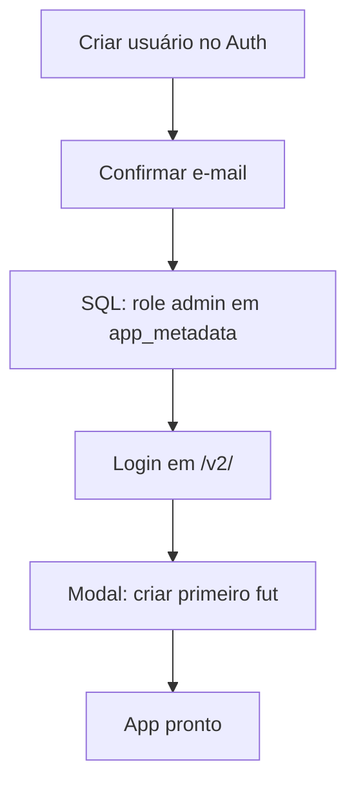

# Criar um novo usuário admin no Supabase (Fut Manager v2)

Guia para cadastrar um administrador que consegue entrar em `/v2/`, criar futs e gerenciar os dados no Postgres.

## Pré-requisitos

- Projeto Supabase **fut-manager** (`lajdoswgtgcuazviewgb`, região `sa-east-1`).
- Migrations aplicadas em [`supabase/migrations/`](../supabase/migrations/) (inclui `202603250004_multi_fut.sql`).
- Edge Functions publicadas: `import-backup`, `export-backup`, `submit-avaliacao`.

Sem a role `admin` no JWT, o app recusa o login e exibe *"Usuário sem role admin"*.

---

## Visão geral



Cada **login Supabase** = um organizador. Cada **fut** = uma pelada isolada (caixa, elenco, partidas). O nome do admin do grupo (quem joga sem mensalidade) é configurado depois em **Ajustes**, por fut.

---

## Passo 1 — Criar o usuário no Dashboard

1. Abra o [Dashboard do Supabase](https://supabase.com/dashboard) e selecione o projeto **fut-manager**.
2. Vá em **Authentication → Users**.
3. Clique em **Add user → Create new user**.
4. Preencha:
   - **E-mail** — o que o admin usará para entrar.
   - **Password** — senha inicial (o admin pode trocar depois, se habilitarem reset por e-mail).
5. Marque **Auto Confirm User** (obrigatório). Sem confirmação, `signInWithPassword` falha.
6. Salve.

> **Importante:** não use *Invite user* se quiser definir a senha agora. O fluxo de convite exige que o usuário complete o cadastro pelo link do e-mail.

---

## Passo 2 — Conceder role `admin`

O Fut Manager v2 só aceita usuários com `app_metadata.role = "admin"`. Essa role vai no **JWT**; por isso deve ficar em `raw_app_meta_data`, **não** em `user_metadata` (editável pelo próprio usuário).

1. No Dashboard, abra **SQL Editor → New query**.
2. Execute (troque o e-mail):

```sql
update auth.users
set raw_app_meta_data = coalesce(raw_app_meta_data, '{}'::jsonb) || '{"role":"admin"}'::jsonb
where email = 'seu@email.com';
```

3. Confira o resultado:

```sql
select id, email, raw_app_meta_data
from auth.users
where email = 'seu@email.com';
```

Deve aparecer algo como `{"role": "admin"}` (pode haver outras chaves se já existiam).

### Vários admins

Repita os passos 1 e 2 para cada organizador. Cada um terá futs próprios (`futs.owner_id = auth.uid()`); um admin **não** vê os futs de outro.

---

## Passo 3 — Primeiro login no app

1. Sirva o projeto localmente ou abra a URL de produção:
   - Local: `http://localhost:4173/v2/` (após `npx serve . -l 4173`)
   - Produção: `/fut-manager/v2/`
2. Entre com o e-mail e a senha criados.
3. Se a role foi definida **depois** de um login anterior, faça logout e entre de novo (**Ajustes → Sair da conta**) para o JWT atualizar.
4. No **primeiro acesso**, aparece o modal **Criar seu primeiro fut** — informe um nome (ex.: `Quarta-feira`).
5. O app cria automaticamente:
   - registro em `futs` (dono = seu `auth.uid()`);
   - `config` inicial do fut;
   - jogador `tipo = 'admin'` (nome vazio até você preencher em Ajustes).

---

## Passo 4 — Configuração recomendada após o login

| Onde | O quê |
|------|--------|
| **Ajustes → Admin do grupo** | Nome de quem organiza e joga sem mensalidade |
| **Ajustes → Mês vigente / taxas** | Valores do caixa |
| **Ajustes → Importar Backup** | Trazer dados da v1 (opcional; só o fut ativo) |
| **Ajustes → Novo fut** | Segunda pelada no mesmo login (opcional) |

---

## Problemas comuns

| Sintoma | Causa provável | Solução |
|---------|----------------|---------|
| *Invalid login credentials* | Senha errada ou usuário não confirmado | Conferir senha; no Dashboard, marcar usuário como confirmado ou recriar com **Auto Confirm User** |
| *Usuário sem role admin* | JWT sem `app_metadata.role` | Rodar o SQL do passo 2; sair e entrar de novo |
| Ajustes vazio / erro 42501 no console | Migrations ou GRANTs faltando | Aplicar migrations; ver [`202603250003_grant_table_privileges.sql`](../supabase/migrations/202603250003_grant_table_privileges.sql) |
| Login ok mas sem dados | Fut não criado ou fut errado selecionado | Criar fut no modal; usar o seletor no topo do header |
| Alterou a role e ainda não funciona | JWT em cache | **Ajustes → Sair da conta** e login novamente |

---

## Referência técnica

- Checagem de admin no banco: função `public.is_admin()` lê `(auth.jwt() -> 'app_metadata' ->> 'role') = 'admin'`.
- Código de login/logout: [`v2/js/api/auth.js`](../v2/js/api/auth.js), [`v2/js/main.js`](../v2/js/main.js).
- Criação de fut: RPC `create_fut(nome)` — ver migration [`202603250004_multi_fut.sql`](../supabase/migrations/202603250004_multi_fut.sql).

Contexto geral do projeto: [`CONTEXTO.md`](../CONTEXTO.md).
